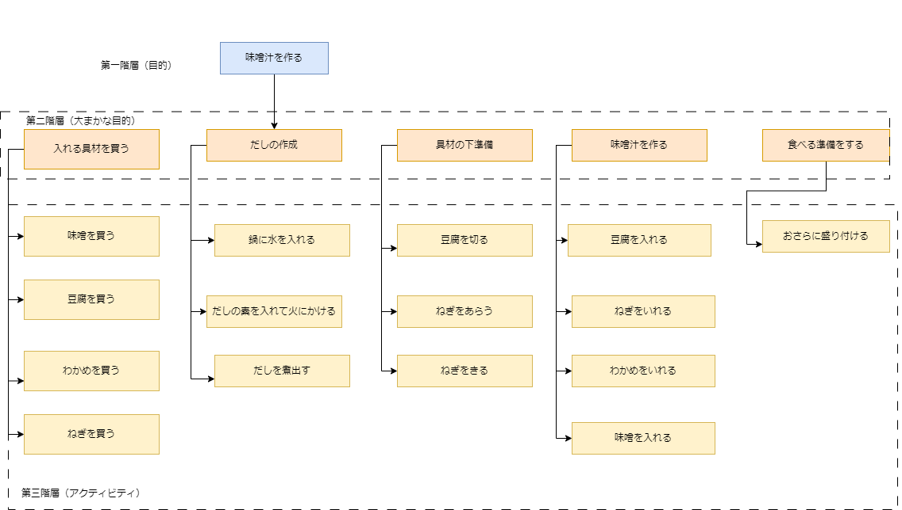
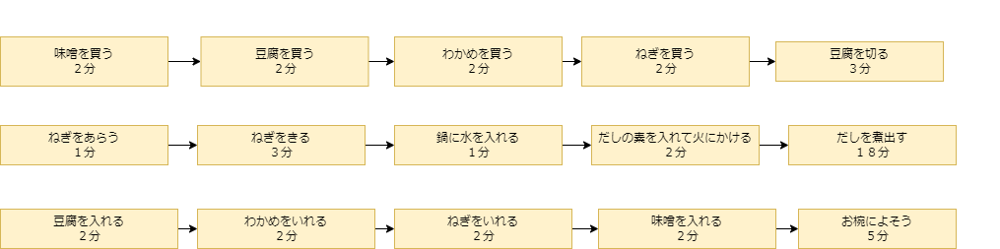
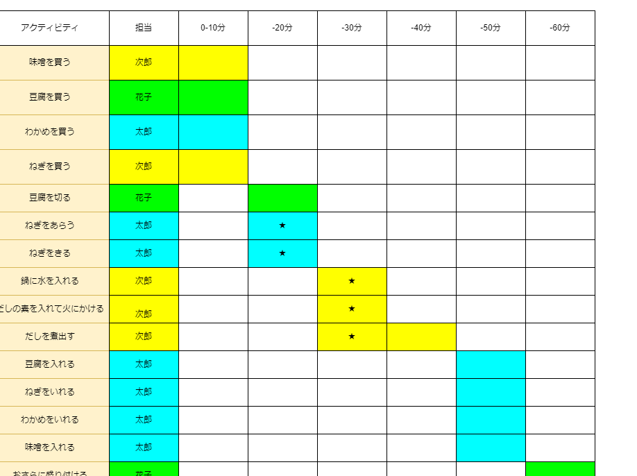

# 味噌汁を作る 
## 材料
- [x] みそを買う
- [x] 豆腐を買う
- [x] わかめを買う
- [x] ねぎを買う
## 手順
1. **ねぎをを準備する**  
   ねぎを洗って切る。
2. **だし汁を作る**  
   鍋に水とだしの素を入れ、火にかけてだし汁を作る。
3. **具材を加える**  
   だし汁が沸騰したら、豆腐、わかめ、ねぎを加え、ひと煮立ちさせる。
4. **味噌を溶かす**  
   味噌を少量ずつ溶かし入れ、火を止める。
5. **盛り付け**  
   椀に注ぎ、完成
## WBS

## 依存関係図

## ガントチャート
